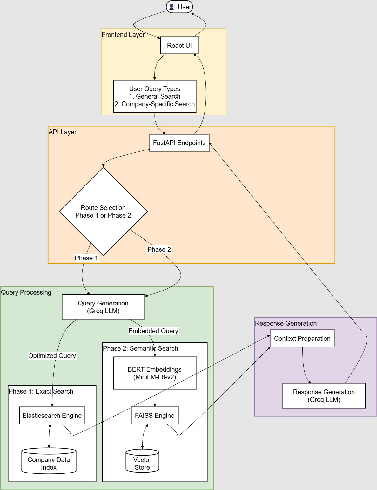
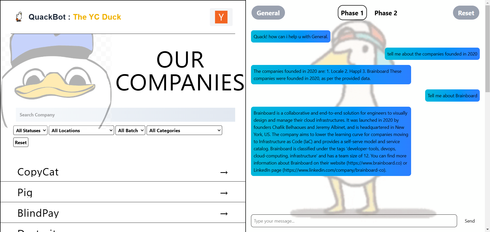
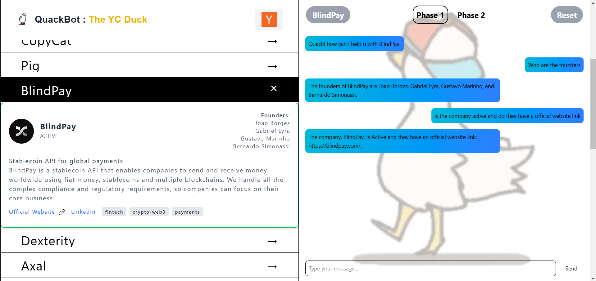

## 📋 System Overview


*High-level architecture showing the integration of RAG, FAISS, Elasticsearch, and Llama-3.3-70B*

## 🌟 Key Features

### 🤖 AI & ML Capabilities
- RAG (Retrieval-Augmented Generation) architecture for accurate, context-aware responses
- Integration with Llama-3.3-70B through Groq for state-of-the-art language processing
- Dual-phase semantic search using FAISS (Facebook AI Similarity Search) and Elasticsearch
- BERT embeddings for advanced semantic understanding
- Hybrid search architecture combining dense and sparse retrievals

### ⚡ Backend Technology
- FastAPI for high-performance async operations
- Vector similarity search with FAISS
- Full-text search capabilities with Elasticsearch
- Containerized deployment with Docker
- Enterprise-grade CORS security

### 🎯 Frontend Innovation
- Modern React application with hooks and context
- Real-time search functionality
- Interactive AI chat interface
- Dynamic company information display
- Responsive Material Design



*YC Scout's intuitive interface showing company search and chat capabilities*

## 🔧 Technical Stack

### 🧠 AI/ML Stack
- Llama-3.3-70B (via Groq)
- BERT Embeddings
- FAISS Vector DB
- Elasticsearch

### 🔄 Backend Stack
- Python 3.12.6
- FastAPI
- Docker
- Groq API
- Vector Databases

### 💫 Frontend Stack
- React 18+
- Vite
- Material UI
- Axios
- Modern JavaScript

## 🚀 Setup Guide

### Prerequisites
- Docker and Docker Compose
- Node.js 18+ and npm
- Python 3.12.6
- Groq API key
- Elasticsearch 7.10.0

### Backend Setup
```bash
cd Backend
```
Double-click on `Setup.bat` to set up the Python environment, set up PyElastic at Docker, and then set up PyElastic indexes.

After that, run `backend.bat` to start the backend server.

### Frontend Setup
```bash
cd Frontend
```
Run `Setup.bat` to set up the frontend environment.

Then, run `frontend.bat` to start the frontend server.

## Access the application:
- Frontend: http://localhost:5173
- API Documentation: http://localhost:8000/docs

## 📁 Directory Structure
```
project/
├── 🔹 backend/
│   ├── main.py                 # FastAPI application
│   ├── requirements.txt        # Python dependencies
│   ├── .env                    # Environment variables
│   ├── DataBase DataLoader.py  # Elasticsearch data loader
│   ├── DataBase DataLoader2.py # FAISS index generator
│   ├── faiss_index.bin        # Vector embeddings
│   ├── combinedata.json       # Metadata store
│   └── data/
│       └── company_data_cleaned_final.json
│
├── 🔸 frontend/
│   ├── src/
│   │   ├── components/        # React components
│   │   ├── pages/            # Route pages
│   │   ├── services/         # API services
│   │   ├── utils/           # Helper functions
│   │   ├── App.jsx          # Main application
│   │   └── main.jsx         # Entry point
│   ├── public/
│   ├── index.html
│   ├── package.json
│   └── .env
│
└── README.md
```